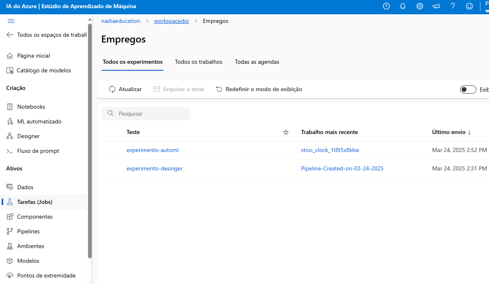
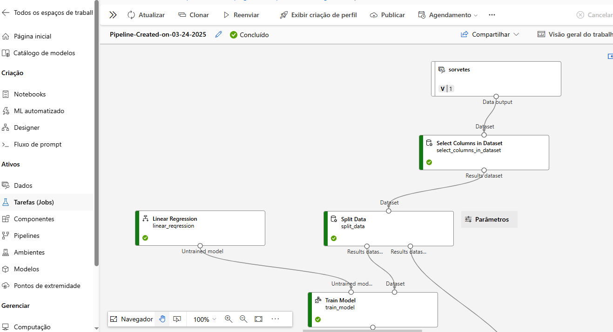
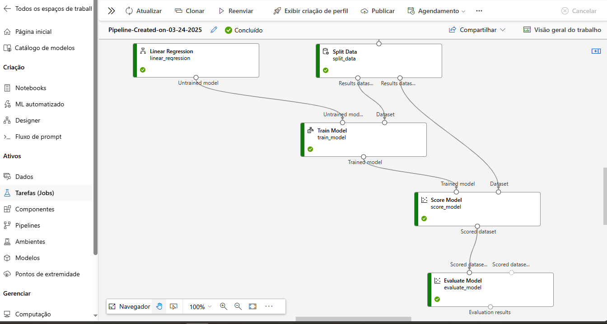
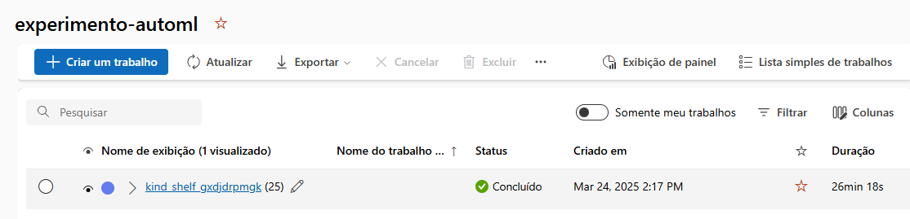
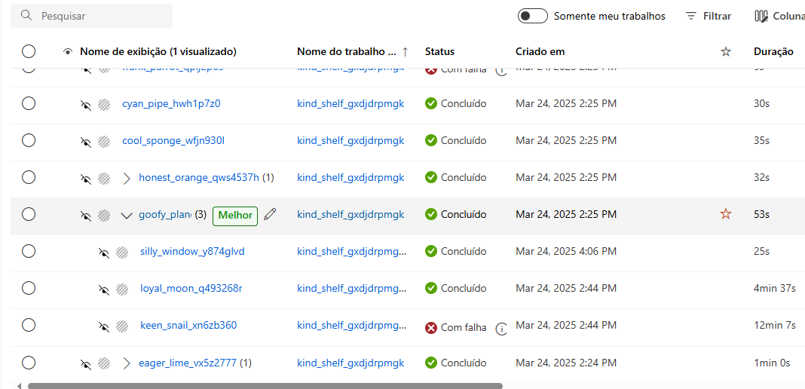
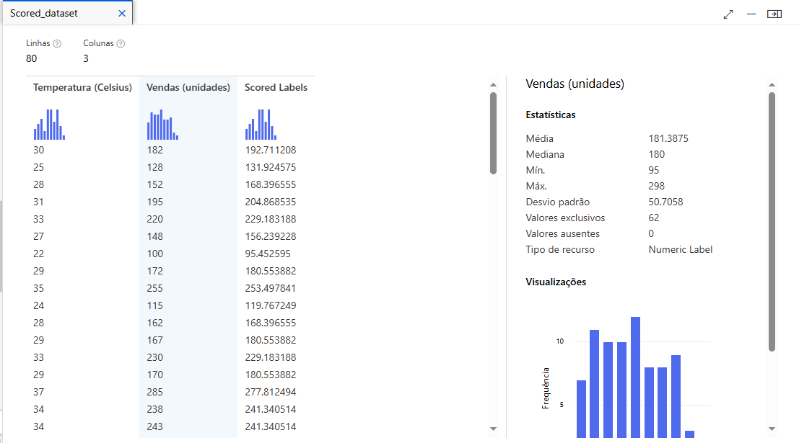

  

# **Sorveteria Ilha do Sol 🍦**
*Descubra como temperatura e sorvete andam de mãos dadas!*

---

## **Descrição do Projeto** 📝
O objetivo deste projeto é desenvolver um modelo de regressão preditiva para analisar a relação entre **vendas de sorvete** e **temperatura**. A ideia é prever padrões e identificar como variáveis externas afetam as vendas.

---

## **Visualizações Principais** 📊
Abaixo estão algumas representações visuais do projeto:

  
  

  
  

  
  

---

## **Métricas Principais** 📈
Aqui estão as métricas mais importantes do projeto:

- **Vendas Diárias Médias:** 190 unidades
- **Temperatura Média:** 31°C
- **Correlação Temperatura-Vendas:** 0,92

> Com base nos dados, existe uma forte correlação positiva entre o aumento da temperatura e o aumento das vendas. 🌞🍧
