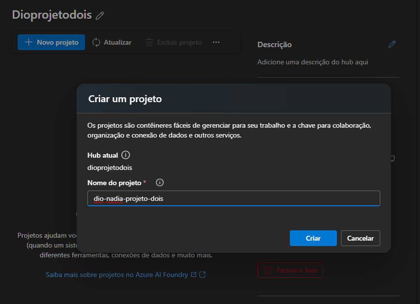
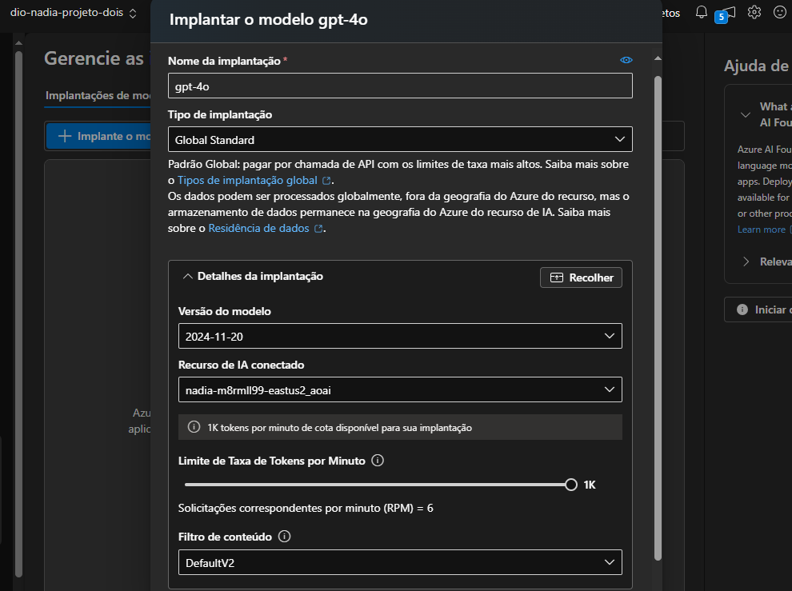
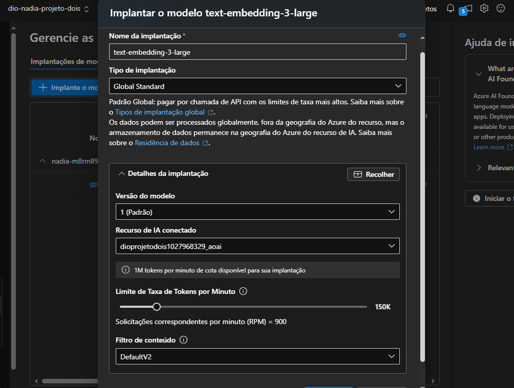
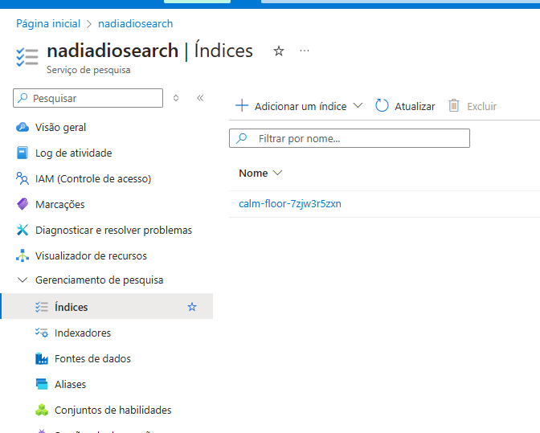
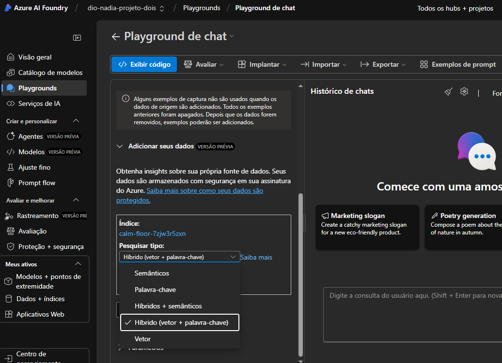
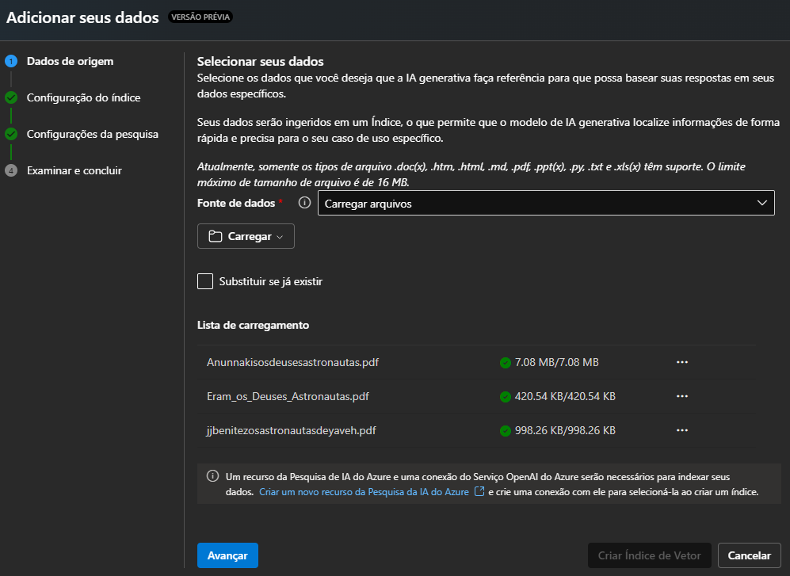
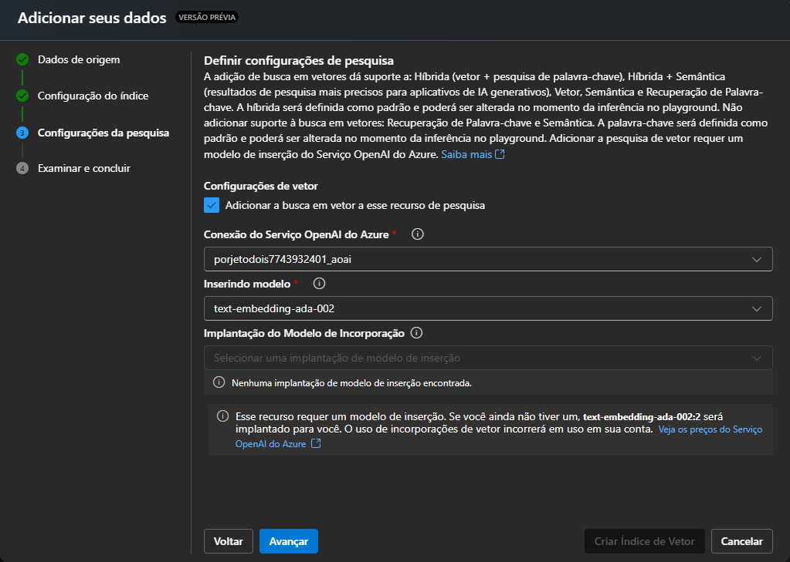
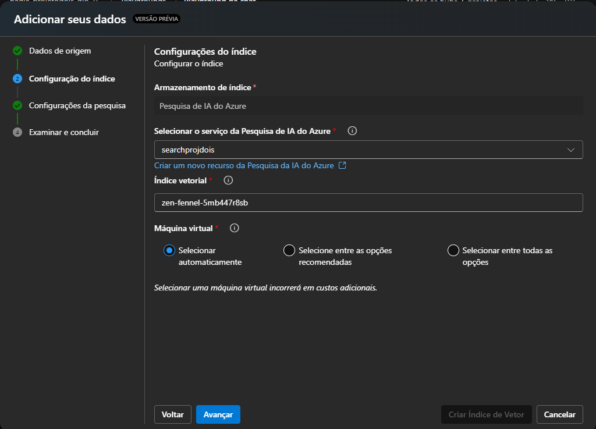
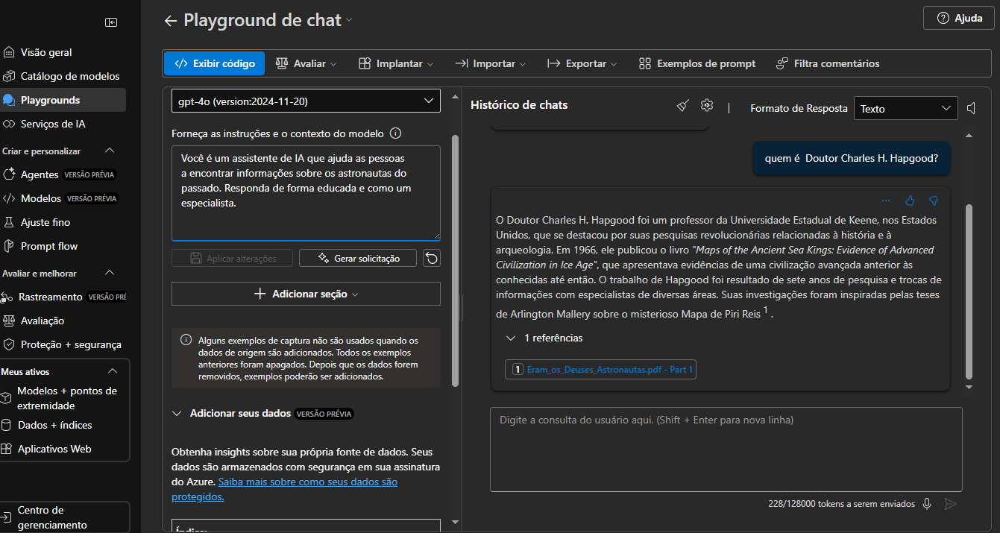
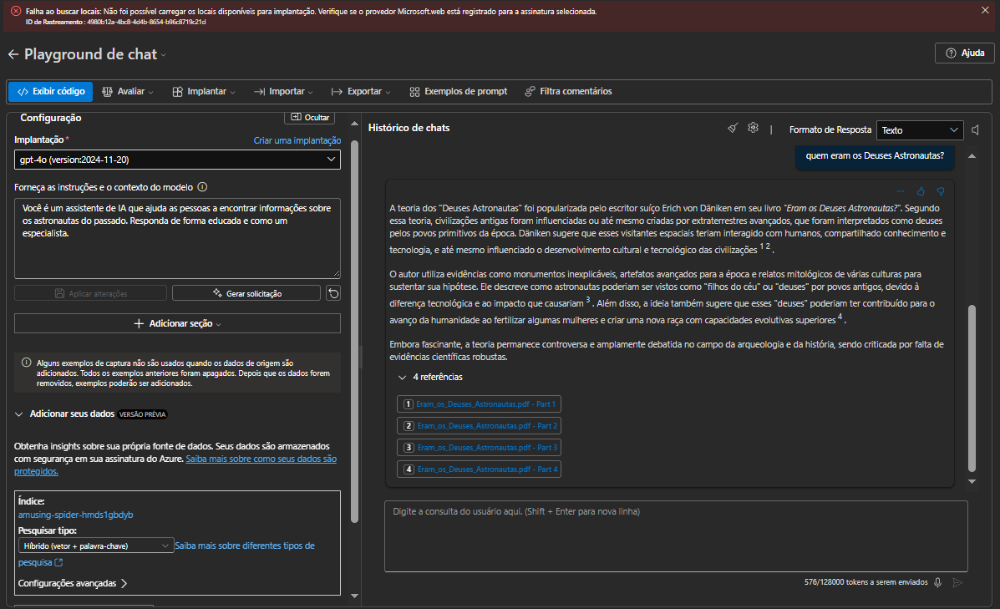

# **Chatbot Baseado em Conteúdo de PDFs** 🤖📄

## **Visão Geral do Projeto** 💡
Este projeto é focado na criação de um chatbot interativo capaz de responder perguntas com base no conteúdo de arquivos PDF fornecidos. A iniciativa utiliza conceitos de inteligência artificial generativa, embeddings e buscas vetorizadas para estruturar um sistema avançado de recuperação de informações. 

**Tema do Projeto:** _Estudos dos Antigos Astronautas do Passado_

Por meio desse sistema, será possível explorar e desvendar informações contidas em documentos sobre teorias, evidências arqueológicas e relatos históricos relacionados aos antigos astronautas.   

## **Cenário** 🌌

Imagine um mundo onde as teorias sobre visitas extraterrestres à Terra se tornam um dos principais focos de estudo acadêmico e cultural. Este projeto visa criar uma ferramenta que permita explorar essas teorias por meio de dados documentados.

O sistema será uma ponte entre a curiosidade humana e a busca por respostas sobre possíveis contatos com civilizações alienígenas no passado remoto. Ele será particularmente útil para pesquisadores, entusiastas e curiosos fascinados pelo tema.

## **Fluxo de Trabalho** 🔄

1. **Carregamento de PDFs**: O usuário faz o upload de arquivos contendo informações sobre os antigos astronautas.
2. **Processamento do Conteúdo**: O sistema extrai textos relevantes dos PDFs e os converte em embeddings para facilitar a busca.
3. **Busca Vetorial**: As perguntas do usuário são transformadas em vetores e comparadas aos dados indexados.
4. **Geração de Respostas**: Com o auxílio de IA, respostas contextuais e fundamentadas são geradas e apresentadas no chat.

## **Representações Visuais do Projeto** 📊

  
Imagens 1 e 2: Criando Hub e o Projeto no Azure IA Foundry.

  
  

  
Imagens 3 e 4: Utilizando os modelos de GPT gpt-4o e text-embedding-3-large.

  
  

  
Imagens 5 e 6: Configurando o Search para utilizar como indexador.

  
  

  
Imagens 7, 8 e 9: Adicionando a base de dados (PDFs), foram adicionados 3 arquivos

  
  
  

  
Imagens 10 e 11: Interagindo com o chatbot, enviando sentenças de testes

  
  

> Não foi possivel criar uma versão Web.
